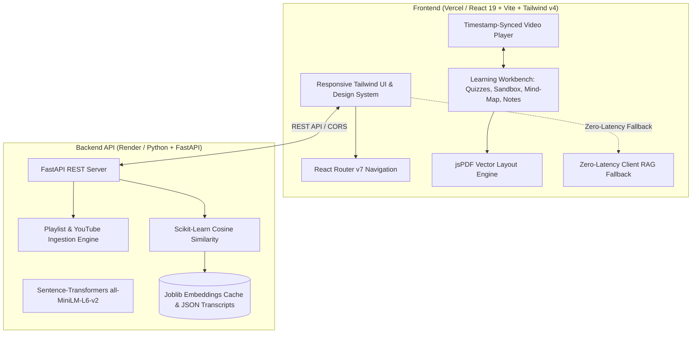

# 🛠️ LectureAI — Complete Tech Stack & Architectural Guide

This document details every technology, framework, library, and architectural pattern used in **LectureAI**, including **what** each tool is, **where** it is used, and the **engineering rationale** for choosing it.

---

## 🏗️ High-Level System Architecture

---

## 1. 🎨 Frontend Stack (User Interface & Learning Workbench)

| Technology | Version | Category | Primary Role in LectureAI | Why It Was Chosen |
| :--- | :--- | :--- | :--- | :--- |
| **React** | `^19.2.8` | UI Library | Core component hierarchy & reactivity | Industry-standard component architecture with React 19 concurrent rendering, seamless state scheduling, and high-performance DOM reconciliation for thousands of transcript chunks. |
| **TypeScript** | `~6.0.2` | Language | Strict type safety across all layers | Enforces compile-time type safety across complex data models (`Lecture`, `TranscriptChunk`, `CourseItem`, `LectureCurriculum`, `QuizItem`), eliminating runtime `undefined` errors. |
| **Vite** | `^8.3.0` | Build Tool | Development server & production bundler | Native ES modules (`ESM`) provide instant sub-second hot-reloads during development and optimized Rolldown/Rollup chunking (compiles production bundle in < 1s). |
| **Tailwind CSS** | `^4.3.3` | Styling | Design system & micro-animations | Utility-first CSS framework (v4 engine) enabling sleek dark-mode aesthetics, custom gradients, CSS variable tokens, and smooth responsive layouts without writing bulky CSS files. |
| **@tailwindcss/vite** | `^4.3.3` | Bundler Plugin | Vite compilation integration | Integrates Tailwind v4 directly into the Vite build pipeline for lightning-fast incremental style rebuilding. |
| **React Router** | `^7.18.3` | Client Routing | Declarative single-page routing | Seamless navigation between Courses (`/lectures`), Lesson Workspace (`/lectures/:number`), Search (`/search`), History (`/history`), and Bookmarks (`/bookmarks`) without full page reloads. |
| **Lucide React** | `^1.46.0` | Iconography | Visual iconography across the app | Lightweight, customizable, accessible SVG icons for video controls, tabs, quiz indicators, terminal logs, and mind-map nodes. |
| **jsPDF** | `^4.2.1` | Document Engine | Client-side PDF generation | Programmatically generates structured, multi-page **Master Course Syllabuses & Lecture Study Guides** with two-pass page numbering directly in the browser with zero server load. |

---

## 2. ⚡ Backend & Machine Learning Stack (Python API Layer)

| Technology | Version | Category | Primary Role in LectureAI | Why It Was Chosen |
| :--- | :--- | :--- | :--- | :--- |
| **Python** | `3.10+` | Programming Language | Core backend & ML runtime | The de-facto standard language for artificial intelligence, natural language processing (NLP), and scientific data pipelines. |
| **FastAPI** | `>=0.104.0` | Web Framework | REST API endpoints & streaming | Built on Starlette and Pydantic; offers native asynchronous concurrency (`async`/`await`), automatic Swagger documentation, and high performance compared to Flask/Django. |
| **Uvicorn** | `>=0.24.0` | ASGI Server | Production HTTP application server | Asynchronous Server Gateway Interface running the FastAPI app on an event loop to handle concurrent client requests efficiently. |
| **Pydantic** | `>=2.0.0` | Data Validation | Request & response schemas | Validates incoming payloads (`/api/ask`, `/api/process-video`, `/api/process-playlist`) with type validation and clear error reporting. |
| **Sentence-Transformers** | `>=3.0.0` | Machine Learning | Semantic vector embeddings | Implements `all-MiniLM-L6-v2` to convert spoken text into 384-dimensional dense vectors, capturing semantic meaning rather than mere keyword matches. |
| **PyTorch** | `>=2.0.0` | Deep Learning Framework | Tensor computation & model inference | Underlies Sentence-Transformers for accelerated neural network forward passes during query embedding generation. |
| **Scikit-Learn** | `>=1.2.0` | Machine Learning | Cosine similarity vector search | Computes cosine similarity between query vectors and thousands of indexed lecture chunks in milliseconds to retrieve the most relevant video moments. |
| **NumPy** | `>=1.24.0` | Numerical Computing | Vector matrix operations | Provides high-performance multidimensional array math for vector normalization and distance metrics. |
| **Joblib** | `>=1.3.0` | Data Serialization | Embeddings disk cache (`embeddings.joblib`) | Precomputes and caches 67MB+ of sentence embeddings to disk, allowing the server to boot and search instantly without recomputing embeddings on every restart. |
| **Requests** | `>=2.31.0` | HTTP Client | Playlist & YouTube metadata scraper | Fetches raw playlist metadata and `ytInitialData` from YouTube playlist URLs without requiring paid API keys or hitting quota limits. |

---

## 3. 🎙️ Multimedia & Audio Ingestion Pipeline (Offline Preprocessing)

| Tool / Pipeline | Category | Purpose in LectureAI |
| :--- | :--- | :--- |
| **OpenAI Whisper** (`mp3_to_json.py`) | Speech-to-Text (ASR) | Transcribes spoken lecture audio into clean, punctuated text with word-level start/end timestamps. |
| **MoviePy / FFmpeg** (`video_to_mp3.py`) | Audio/Video Processing | Extracts compressed `.mp3` audio tracks from `.mp4` video files to optimize speech recognition processing. |
| **Sliding Window Chunker** (`preprocess_json.py`) | NLP Preprocessing | Aggregates short 2-second subtitle segments into semantic 30–60 second chunks for high-relevance RAG indexing. |

---

## 4. 🧠 Interactive In-Browser Learning Engines

### **A. Sandboxed Code Playground (`CodePlayground.tsx`)**
* **Technologies**: HTML5 `iframe` with `sandbox="allow-scripts"`, `window.postMessage` bridge, Monaco-style textarea.
* **Why**: Allows students learning web development to write HTML/CSS/JS and view live rendered results next to the video. The `postMessage` bridge intercepts `console.log()` outputs and displays them in an in-browser virtual terminal.

### **B. Active Recall & Anki Flashcard Engine (`InteractiveQuiz.tsx`)**
* **Technologies**: CSS 3D Transforms (`rotateY`), React state machine, dynamic distractor generator.
* **Why**: Enhances learning retention using proven cognitive science principles. Generates interactive multiple-choice tests with real-time feedback and Anki-style flip cards with spaced repetition ratings (`Review Again` vs `Mastered`).

### **C. Concept Knowledge Graph / Mind-Map (`ConceptGraph.tsx`)**
* **Technologies**: SVG vector canvas, connecting timeline rails, category filters.
* **Why**: Visualizes how core lecture topics connect to code blueprints, spoken milestones, and gotcha traps. Every node is clickable and deeply linked to the video timestamp (`onSeek`).

### **D. Timestamped Notes & Notion Exporter (`LectureNotes.tsx`)**
* **Technologies**: HTML5 `localStorage`, Markdown parser, dynamic Blob download.
* **Why**: Auto-saves personal student notes per lecture. The "Tag Video Time" button inserts clickable `[⏱ MM:SS]` timestamp badges. The "Export to Markdown" button produces ready-to-import files for Notion or Obsidian.

### **E. Client-Side RAG Fallback (`curriculumRAG.ts` & `localSearch.ts`)**
* **Technologies**: In-memory keyword & n-gram tokenizer, heuristic relevancy scoring.
* **Why**: Ensures that even if the Python backend is sleeping (e.g. Render free tier spin-down), users can still search and get AI answers in 0ms with zero server errors.

---

## 5. 🌐 Hosting, Cloud & DevOps Infrastructure

| Service | Role | Configuration Details |
| :--- | :--- | :--- |
| **Vercel** | Frontend Cloud Hosting | Deploys the React 19 + Vite frontend to a global edge CDN with automatic HTTPS and asset caching at `https://lecture-ai-seven-beta.vercel.app`. |
| **Render** | Backend API Cloud Hosting | Hosts the FastAPI Python application with continuous deployment via `Procfile` and `Dockerfile` at `https://lecture-ai-api.onrender.com`. |
| **GitHub** | Source Control & CI/CD | Manages git history and triggers automatic redeployment on every commit pushed to `main` (`https://github.com/Kinshunk565/Lecture-AI.git`). |
